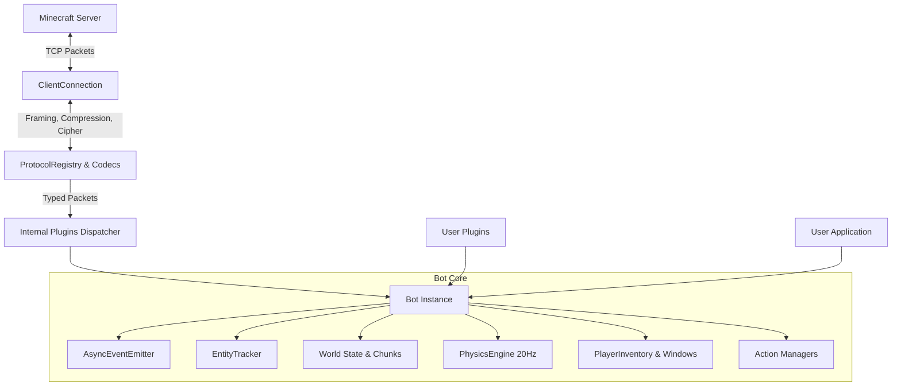

# Mineflex Architecture

Mineflex is engineered with strict modular boundaries, decoupling protocol framing, data registries, world state, physics simulation, and bot behaviors.

---

## High-Level Architecture Diagram

---

## Core Subsystems

### 1. `mineflex.protocol`
* **Buffer Codecs**: `PacketReader` and `PacketWriter` implementing VarInt, VarLong, UUID, IEEE-754 floats/doubles, strings, and 64-bit block positions.
* **Framing**: `PacketFramer` managing length prepending, frame deframing, and optional zlib packet compression / decompression.
* **Encryption**: `EncryptionCipher` wrapping AES-128 CFB8 stream ciphers.
* **Registry**: `ProtocolRegistry` mapping `(state, is_serverbound, id/name)` tuples to strongly typed `Packet` classes across versions.

### 2. `mineflex.world`
* **Paletted Containers**: `ChunkSection` parses 4096-block 1.20+ paletted bit arrays (single-value, indirect palette, direct palette).
* **Chunk Columns**: `Chunk` manages 24 vertical sections spanning Y = -64 to 320.
* **World Interface**: `World` manages loaded columns, provides `block_at`, `set_block_state`, `find_blocks`, and computes precise intersecting AABB collision shapes.

### 3. `mineflex.physics`
* Completely standalone and testable independently of network I/O.
* Simulates 20 Hz ticks with exact Minecraft constants:
  * Gravity (-0.08 blocks/tick²)
  * Terminal velocity (-3.92 blocks/tick)
  * Air drag (0.98), ground friction (0.6 default slipperiness * 0.91)
  * Jump impulse (+0.42 blocks/tick)
  * Auto-stepping over 0.6 block height differences without jumping.
* Collision resolution resolves AABB projections across Y, X, and Z axes.

### 4. `mineflex.inventory`
* Server-authoritative slot and container modeling.
* Player inventory (window 0) tracks all 46 slots (crafting result, grid, armor, main inventory, hotbar, and offhand).
* Handles container windows (chests, crafting tables, furnaces) with click transactions.

### 5. `mineflex.plugins`
* Bot logic is organized into internal plugins (`chat`, `health`, `game`, `time`, `blocks`, `entities`, `physics`, `inventory`, `actions`), avoiding monolithic god classes.
* Extensible plugin system supporting both class-based `Plugin` and callable functions.
